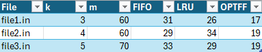

# Cache Eviction Policy Simulator

## Student Info
- Name: William Jesser
- UFID: 5963-4986

## How to Run
- Requires Python 3.10+.
- From the repo root: `python src/cache_sim.py <input-file>`
- Example: `python src/cache_sim.py data/example.in`
- Use `-` to read from stdin.

## Repository Layout
- `src/cache_sim.py` - simulator for FIFO, LRU, and OPTFF.
- `data/` - sample inputs (`*.in`) and expected outputs (`*.out`).
- `tests/` - unit tests (pytest).

## Example Input/Output
- Input: `data/example.in`
- Expected output (also in `data/example.out`):
```
FIFO  : 4
LRU   : 4
OPTFF : 4
```

## Written Component

### Q1. Empirical Comparison (>=50 requests each)


Comments:
- OPTFF always has the fewest misses, as expected from optimality.
- FIFO vs LRU depends on the sequence: in file1/file3 LRU wins; in file2 FIFO beats LRU because the pattern repeats with weak temporal locality, so LRU evicts useful items more often.

### Q2. Sequence where OPTFF < LRU (k = 3)
- Sequence: `1, 2, 3, 4, 1, 2, 5, 1, 2, 3, 4, 5`
- Miss counts with k = 3: FIFO = 9, LRU = 10, OPTFF = 7.
- Why LRU loses: after `1,2,3`, the next `4` forces an eviction; LRU drops `1`. Soon after, `1` is needed twice before `3` or `4` return, so those misses cascade. OPTFF keeps items with the nearest future use (keeps `1,2,3`, evicts `4`), avoiding two misses.

### Q3. Proof sketch that OPTFF is optimal
Let OPT be Belady's farthest-in-future policy. Consider any offline algorithm A that knows the whole sequence. We transform A into OPT without adding misses.

Induction on request position i:
- Base: before the first request the caches are empty.
- Step: assume OPT and A have the same cache just before request i. If both hit, move on. If A misses and evicts some page x while OPT would evict y (the page whose next use is farthest in the future), two cases:
  1) A also evicts y: caches stay aligned; miss counts unchanged.
  2) A keeps y and evicts x: swap x back in and evict y instead. Because y is used no sooner than any cached page, this swap cannot create a new miss before y's next use. The modified algorithm has no more misses than A and now matches OPT at step i.
By repeating this exchange, we obtain OPT with miss count <= any offline algorithm A. Thus OPT is optimal for every sequence.

